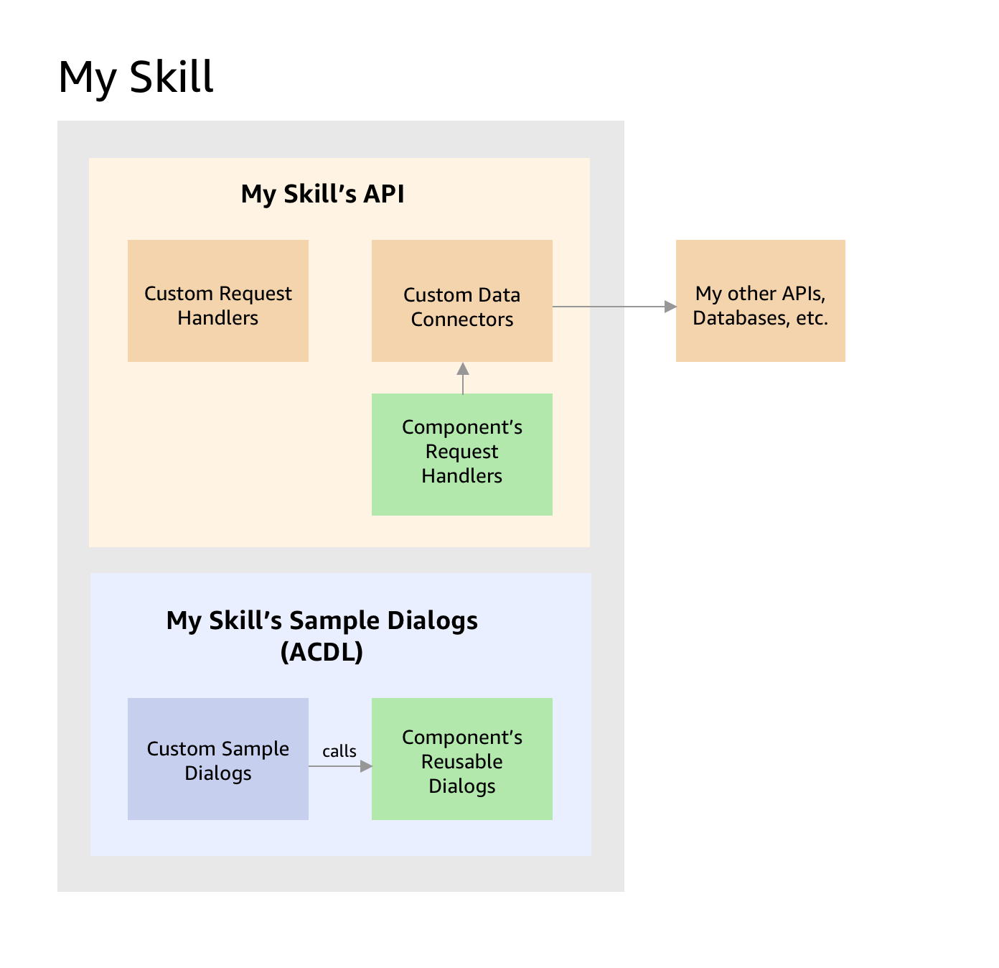

  
   
  <h1 align="center">Alexa Skill Components</h1>

Develop better Alexa skills faster with high-quality pre-made skill components.

**Please note**: Alexa Skill Components are being provided as a pre-production alpha 
release in Developer Preview with limited support. Our goal is to solicit feedback on our approach and design building towards their broader general availability in the future. While we will make every effort to minimize it, we do not make any backwards compatibility or rapid 
turn-around bug-fix promises with this pre-production alpha release. You can [sign 
up for the developer preview](https://build.amazonalexadev.com/2022-Skill-Components-Interest.html) here to use these components.

We will be actively making updates to these components and we look forward to mature them with your feedback. So, check back in here to get the latest and greatest version. 

[Sign up and join us](https://build.amazonalexadev.com/2022-Skill-Components-Interest.html) in our effort to help you build more engaging Alexa skills faster!

## Table of Contents

- [Introduction](#introduction)
- [Getting Started](#getting-started)
- [Components](#components)
- [How Components work](#how-components-work)
- [Contributing](#contributing)
  - [Code of Conduct](#code-of-conduct)
  - [Contributing Guide](#contributing-guide)
- [Support](#support)
- [Security](#security)
- [License](#license)

## Introduction
Skill Components are “ready to use” experiences that you can easily add to your skills, and configure them according to your needs. Each component is a collection of skill primitives, such as VUI dialogs & intents, Alexa Presentation Language (APL) documents, skill code, skill connection tasks, and skill events. They bring together design best practices and pre-built voice experiences, which solve for a myriad of interaction paths that a customer can take. You can import these components into your existing Skill Package, compile, and then deploy your skill. These components are built *_using Alexa Conversations (AC) and the Alexa Conversations Description Language (ACDL)_*. 

## Getting Started
### 1. Install prerequisites

* Ensure you have [Node.js](https://nodejs.org/en/) v16.13.1+ and [NPM](https://www.npmjs.com/) v8.1.2+
* Install the [ASK CLI for Alexa Conversations](https://developer.amazon.com/en-US/docs/alexa/conversations/acdl-set-up-ask-cli.html)
  * run `askx configure` to link your Alexa and AWS accounts to the CLI

### 2. Familiarize yourself with Alexa Conversations Skill Development

* [Alexa Conversations](https://developer.amazon.com/en-US/docs/alexa/conversations/about-alexa-conversations.html.)
* [ACDL Language](https://developer.amazon.com/en-US/docs/alexa/conversations/about-acdl.html) (for writing sample dialog flows)
* [APL and APL-A](https://developer.amazon.com/en-US/docs/alexa/alexa-presentation-language/add-visuals-and-audio-to-your-skill.html) (for writing audio/visual responses)
* [Alexa Skills Kit (ASK) Plug-in for VS Code](https://marketplace.visualstudio.com/items?itemName=ask-toolkit.alexa-skills-kit-toolkit)

For those unfamiliar with skill development, the [flight search example skill tutorial](https://developer.amazon.com/en-US/docs/alexa/workshops/acdl-flightsearch-tutorial/get-started/index.html) is a good starting place.

### 3. Understand how components work

[How Components work](#how-components-work)

### 4. Choose a skill component

Choose a [specific skill component](#Components) that interests you and read it's own "Getting State" guide.

## Components
The following skill components are contained in this package:

| Component                                   | Description                            | Status          | NPM Package |
| :-----------------------------------------: | :------------------------------------: | :-------------: | :---------: |
| [Feedback Elicitation](feedback-elicitation) | Collect user feedback for your skill   | Private Preview | [Here][1]        |
| [Catalog Explorer](catalog-explorer) | Explorer a catalog of items including ability to search, refine and perform actions   | Private Preview | [Here][2]        |
| [List Navigation](list-navigation) | Pre-built experience to navigate through a list of items   | Private Preview | [Here][3]        |
| [Account Linking](account-linking) | Simplifies enabling account linking for your skill   | Private Preview | [Here][4]        |
| [In Skill Purchases](in-skill-purchase) | pre-built experience to enable in-skill purchases   | Private Preview | [Here][5]        |
| [Checkout](checkout) | Enable users to pay to the business for their goods or services with a full checkout experience  | Private Preview | [Here][6]        |

## How Components Work

  <h5 align="left">Component Architecture</h5>
  
   
  

  

Components are [NPM](https://www.npmjs.com/) packages that skill developers can import into their skills; each component contains sample dialog flows (in the form of a 
[ACDL reusable dialog](https://developer.amazon.com/en-US/docs/alexa/conversations/acdl-reusable-dialogs.html)) 
and API request handlers (developed in [TypeScript](https://www.typescriptlang.org/)) alongside default utterances and audio/visual responses (to aid in an easy on-boarding).

When a skill is deployed, the ACDL, API handlers, responses, etc. from any components being used by the skill will be merged into the skill's other resources and built at the same time.

Note that a skill must be using [ACDL](https://developer.amazon.com/en-US/docs/alexa/conversations/acdl-files.html) to utilize skill components.

[Feedback Elicitation](./feedback-elicitation) is the easiest component to start with to better understand skill components.

## Contributing
Alexa's aim is to create a vibrant ecosystem of components jointly developed with the community of Alexa skill developers; all forms of contribution to skill components is welcome, including:

* [Submitting issues](https://github.com/alexa/skill-components/issues/new) to help us identify bugs, shortcomings and propose additional components.
* [Submitting pull requests](https://github.com/alexa/skill-components/pulls) for changes to existing components or with a proposed new component.
* Providing feedback on issues and pull requests.
* Helping us expand and improve documentation
* Helping other skill developers [on StackOverflow](https://stackoverflow.com/questions/tagged/alexa-skill-components) utilize skill components
* Discussing components and helping others in the [Alexa Slack community](https://alexa.design/slack) or [Developer Forum](https://amazon.developer.forums.answerhub.com/spaces/23/index.html)

### Code of Conduct
This project has adopted the [Amazon Open Source Code of Conduct](https://aws.github.io/code-of-conduct). For more information see the [Code of Conduct FAQ](https://aws.github.io/code-of-conduct-faq) or contact opensource-codeofconduct@amazon.com with any additional questions or comments.

### Contributing Guide
Read our [contributing guide](CONTRIBUTING.md) for more information.

## Support
Alexa is dedicated to ensuring skill developers of all experience levels can utilize skill components.

If your just getting started, make sure to review the [general documentation](#Documentation) and the documentation of any [specific component](#Components) that interests you.

If you want to discuss or need some help, please reach out the [Slack community](https://alexa.design/slack),  [Developer Forum](https://amazon.developer.forums.answerhub.com/spaces/23/index.html), or [on StackOverflow](https://stackoverflow.com/questions/tagged/alexa-skill-components).

If you notice an issue in a component or wish to propose a new component, please [submit a GitHub issue](https://github.com/alexa/skill-components/issues/new).

If your having trouble building a specific skill, then please reach out on the [Alexa developer contact form](https://developer.amazon.com/alexa/console/contact-us)

## Security
See [security issue notifications](CONTRIBUTING.md#security-issue-notifications) for more information on how to report security issues.

## License
This library is licensed under the [Amazon Software License](LICENSE).

[1]:https://www.npmjs.com/package/@alexa-skill-components/feedback-elicitation
[2]:https://www.npmjs.com/package/@alexa-skill-components/catalog-explorer
[3]:https://www.npmjs.com/package/@alexa-skill-components/list-navigation
[4]:https://www.npmjs.com/package/@alexa-skill-components/account-linking
[5]:https://www.npmjs.com/package/@alexa-skill-components/in-skill-purchase
[6]:https://www.npmjs.com/package/@alexa-skill-components/checkout